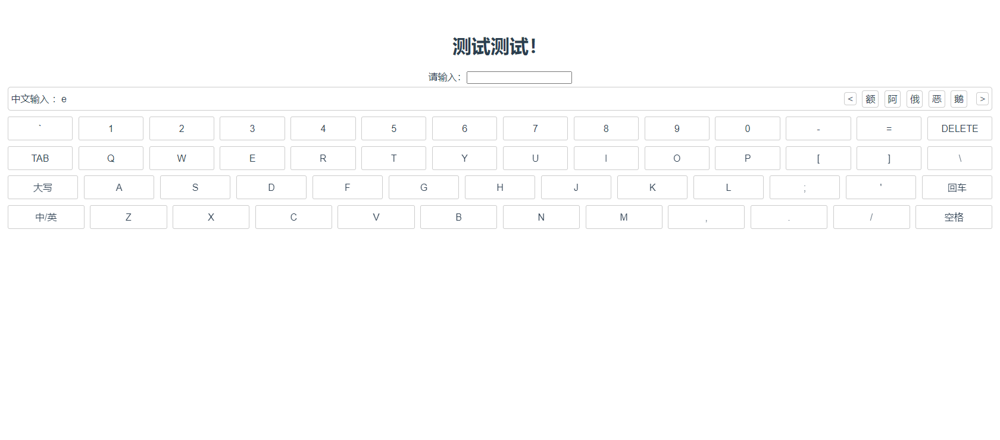

# rare-word-keyboard

## 介绍
一个简单的拼音输入键盘，数字、中英文、标点符号都可以正常输入输出



## Project setup
```
npm install
```

### Compiles and hot-reloads for development
```
npm run serve
```

### Compiles and minifies for production
```
npm run build
```

### Customize configuration
See [Configuration Reference](https://cli.vuejs.org/config/).
